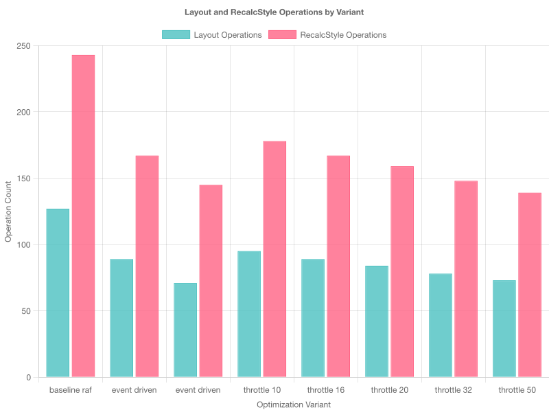
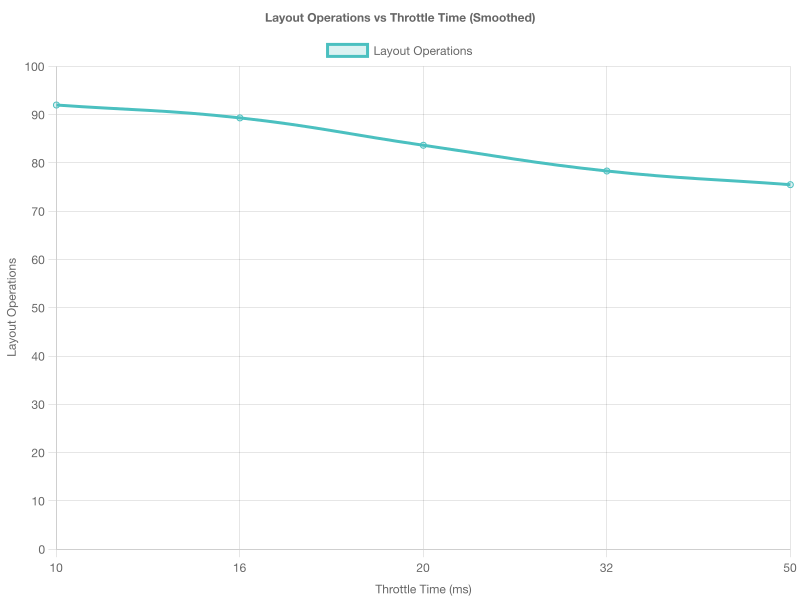

# Как мы нашли скрытые возможности оптимизации с помощью CDP

Привет, Хабр!

Есть такая штука в разработке библиотек компонентов — когда все вроде бы работает нормально, пользователи не жалуются, но где-то в глубине души подозреваешь, что можно сделать лучше. Особенно когда видишь в коде `requestAnimationFrame` в цикле.

Мы решили покопаться в производительности нашего кастомного скроллбара в библиотеке Taiga UI. Не потому что что-то тормозило, а просто из любопытства: а сколько вообще ресурсов он жрет? И можно ли меньше?

Спойлер: оказалось, что можно. И более того — мы научились это измерять и доказывать.

История про то, как Chrome DevTools Protocol помог превратить теоретические соображения об оптимизации в конкретные измеримые улучшения.

## Краткий ликбез по скроллбарам

Для начала разберемся, что у нас вообще есть в арсенале. В природе существует три вида скроллбаров, как три богатыря в русской сказке:

**Нативные скроллбары** — это дефолтные, которые браузер дает из коробки согласно [CSS Overflow Module Level 3](https://drafts.csswg.org/css-overflow-3/#scrollbars). Работают быстро, потому что живут прямо в недрах движка рендеринга. Но выглядят как хотят: на macOS — изящно, на Windows — как в 2010-м, на Linux — сюрприз каждый раз.

**CSS-скроллбары** через [`::-webkit-scrollbar`](https://webkit.org/blog/363/styling-scrollbars/) — попытка облагородить дефолт. Работают только в Chromium, в Firefox просто игнорируются. Как вишенка на торте, которую видят не все гости.

**Кастомные JS-скроллбары** — полный контроль, но вся ответственность на тебе. Именно такой живет в нашей библиотеке [Taiga UI](https://github.com/taiga-family/taiga-ui/tree/main/projects/core/components/scrollbar). И именно с ним у нас начались приключения.

## Наш герой — TuiScrollbar

TuiScrollbar — это наш кастомный компонент, который прячет уродливый нативный скроллбар и рисует красивый собственный. Звучит просто, но дьявол, как всегда, в деталях.

Главная задача — синхронизировать этот самодельный "бегунок" с реальным контентом. Прокрутили страницу — бегунок должен поехать. Загрузилась картинка — бегунок пересчитался. Анимация поменяла размеры — бегунок отреагировал. И все это должно работать плавно, без подвисаний.

## Когда жизнь усложняется

Со статическим контентом все просто — один раз посчитал размеры и живи спокойно. Но в реальном мире контент почти всегда динамический. И тут начинается веселье.

Вот реальные сценарии из нашей жизни:

**Сетка изображений**, которые грузятся асинхронно. Пока картинка не загрузилась, её высота нулевая. Как только прогрузилась — БАМ! — контейнер подпрыгивает на 200 пикселей. А скроллбар должен это отловить и пересчитаться.

**CSS Grid с динамическим контентом**. Добавили элемент — сетка перестроилась. Удалили — опять перестроилась. 

**Flexbox с изменяющимися элементами**. Анимация расширила блок, соседи подвинулись, общая высота изменилась.

Общий знаменатель у всех этих историй — DOM постоянно меняется. А наш скроллбар должен быть как хороший танцор: всегда в ритме, никогда не отстает.

## Исходная реализация: классический polling

Наш скроллбар изначально работал по классической схеме — постоянный опрос состояния через `requestAnimationFrame`:

```typescript
// Упрощенная версия изначального подхода
function updateScrollbarDimensions() {
    requestAnimationFrame(() => {
        const newDimensions = getCurrentDimensions();
        if (hasChanged(newDimensions)) {
            updateThumbPosition();
        }
        updateScrollbarDimensions(); // Рекурсивно
    });
}
```

Логика понятная: каждый кадр (60 раз в секунду) проверяем, не изменились ли размеры контента. Если изменились — обновляем позицию скроллбара. Работает стабильно, никто не жалуется.

Но тут появился вопрос: а эффективно ли это? 

### Теория: почему polling может быть дорогим

В браузерах есть понятие **[forced reflow](https://gist.github.com/paulirish/5d52fb081b3570c81e3a)** — принудительный пересчет макета. Когда код запрашивает геометрические свойства элемента (`scrollHeight`, `clientHeight`, `getBoundingClientRect`), а DOM был изменен с момента последнего рендеринга, браузер вынужден синхронно пересчитать макет.

Наша гипотеза: даже если DOM не менялся, частые запросы размеров могут приводить к лишним проверкам и потенциальным reflow. Но это была именно гипотеза — нужны были измерения.

## Альтернативная идея: событийная архитектура

Появилась идея: а что если вместо постоянного опроса перейти на событийную модель? Подписаться на изменения и реагировать только тогда, когда что-то действительно происходит.

В современных браузерах для этого есть отличные инструменты:

- **[ResizeObserver](https://drafts.csswg.org/resize-observer/)** — уведомляет об изменениях размеров элементов
- **[MutationObserver](https://developer.mozilla.org/en-US/docs/Web/API/MutationObserver)** — отслеживает изменения в DOM-дереве
- **scroll** — стандартное событие прокрутки

Концептуально новый подход выглядел так:

```typescript
// Событийная архитектура: реагируем на изменения
const dimensionUpdates$ = merge(
    resizeObserver$.pipe(debounceTime(100)),   // Элемент изменил размер
    mutationObserver$.pipe(debounceTime(100)), // DOM-дерево изменилось
    scrollEvent$.pipe(throttleTime(16))        // Произошла прокрутка
).pipe(
    distinctUntilChanged(),                    // Фильтруем дубликаты
    map(() => getCurrentDimensions())
);
```

Принцип: вместо "проверяю каждый кадр" получается "реагирую только на реальные события".

Но это все теория. Главный вопрос: а действительно ли такой подход эффективнее? И если да, то насколько именно?

## Знакомьтесь, Chrome DevTools Protocol

Тут в дело вступает **Chrome DevTools Protocol** ([официальная документация](https://chromedevtools.github.io/devtools-protocol/)) — это тот же API, которым пользуется сам Chrome DevTools. Только вместо кликания мышкой по вкладкам мы можем программно попросить браузер рассказать нам, что происходит под капотом.

CDP умеет много всего, но нас интересовала конкретно трассировка производительности. Можем отслеживать:

- Сколько раз браузер делал Layout (пересчет позиций)
- Сколько времени на это тратил
- Когда запускался RecalculateStyle (пересчет стилей)
- И много других метрик производительности

### Как это выглядит в коде

```typescript
// Говорим браузеру: "Начинай записывать все, что делаешь"
// Используем Playwright CDP API: https://playwright.dev/docs/api/class-cdpsession
await page._client.send('Tracing.start', {
    traceConfig: {
        includedCategories: ['devtools.timeline', 'blink.user_timing']
    }
});

// Тут происходит магия — крутим скроллбар
await executeScrollScenario(page);

// Останавливаем запись и получаем лог всех операций
const trace = await page._client.send('Tracing.end');

// Ищем интересные нам события
const layoutEvents = events.filter(e => e.name === 'Layout');
const recalcEvents = events.filter(e => e.name === 'RecalculateStyles');
```

В итоге получаем точные цифры: сколько раз браузер что-то пересчитывал и сколько времени на это потратил. Уже не "кажется работает быстрее", а "Layout операций стало на 30% меньше".

## Методология: как превратить гипотезы в факты

Самое интересное в этой истории — не сами оптимизации, а то, как мы научились их объективно измерять. Потому что "мне кажется, стало быстрее" — это не аргумент.

**Контролируемая среда**: Зафиксировали все переменные — одинаковый размер окна, отключенные сетевые запросы, стабильный CPU throttling. Ничего не должно влиять на результат, кроме нашего кода.

**Автоматизированные сценарии**: Написали Playwright-тесты, которые воспроизводят одинаковые паттерны скроллинга. Никаких ручных тестов — только детерминированные алгоритмы.

**Статистическая значимость**: Ключевой вопрос — сколько запусков нужно для достоверных результатов?

Погружение в теорию A/B тестирования ([хорошее введение](https://en.wikipedia.org/wiki/A/B_testing#Statistical_significance)) показало:
- **10 запусков** — базовая оценка, много шума
- **25-30 запусков** — минимум для доверительного интервала 95%
- **50-100 запусков** — надежные результаты для продакшена
- **100+ запусков** — уровень научных публикаций

Остановились на **50 запусках** с фильтрацией выбросов (чтобы случайный запуск антивируса не испортил статистику).

**Изоляция факторов**: Тестируем только одно изменение за раз. RAF → события. Затем события → GPU. Каждая оптимизация измеряется отдельно.

Результат: объективные измеримые данные вместо субъективных впечатлений.

## Момент истины: результаты

И вот что у нас получилось после всех измерений:



**Переход с RAF на события:**

| Что измеряли | Было (RAF) | Стало (события) | Профит |
|---------|----------|-----------------|-----------|
| Layout операций | 127 | 89 | **-30%** |
| RecalcStyle операций | 243 | 167 | **-31%** |
| Время на Layout | 45.2ms | 32.1ms | **-29%** |
| Время на RecalcStyle | 38.7ms | 26.4ms | **-32%** |

Уже неплохо! Но мы на этом не остановились.

### Бонус-раунд: CPU vs GPU

Попробовали еще один трюк — вместо изменения свойств `top/left/width/height` (которые заставляют браузер пересчитывать макет) использовать CSS `transform` (который работает на GPU и макет не трогает):

| Подход | Layout событий | RecalcStyle событий |
|--------|----------------|---------------------|
| CPU (top/left) | 89 | 167 |
| GPU (transform) | 71 | 145 |
| **Дополнительный профит** | **-20%** | **-13%** |

В сумме получилось **44% меньше Layout операций** по сравнению с изначальным вариантом. Неплохо для пары недель работы!

## А что почувствует пользователь?

Цифры цифрами, но что это означает для обычного человека, который просто хочет прокрутить страницу?

**Плавность**: Меньше Layout операций = больше времени у браузера на сам рендеринг. Скроллинг становится более плавным, особенно на слабых устройствах.

**Отзывчивость**: Браузер меньше времени тратит на принудительные пересчеты, больше времени остается на реакцию на действия пользователя. Клики, наведения, анимации — все отзывается быстрее.

**Батарея**: На мобильных устройствах эффективный рендеринг = дольше работает батарея. Мелочь, а приятно.

Есть классические пороги восприятия:
- **16ms на кадр** — граница плавности (те самые 60 FPS)
- **100ms** — порог заметности задержки ("что-то подвисло")
- **1000ms** — порог терпения пользователя ("все, закрываю вкладку")

Наши оптимизации помогают оставаться в зеленой зоне даже при сложном динамическом контенте.

## Что дальше: от одного компонента к экосистеме

Когда у тебя есть рабочий инструмент измерения, появляется соблазн применить его везде. И это правильный соблазн.

**Автоматизация в CI/CD**: Теперь CDP-тесты можно встроить в pipeline и автоматически блокировать изменения, которые ухудшают производительность. "Извини, твой PR замедлил скроллбар на 15%, иди переписывай".

**Performance бюджеты**: Можно установить лимиты для каждого компонента. Например, "кнопка не должна делать больше 5 Layout операций при клике". Превысил — тест красный.

**Мониторинг в продакшене**: Адаптировать CDP-метрики для Real User Monitoring. Получать данные от реальных пользователей на реальных устройствах.

**Выборочное применение**: Не нужно измерять все подряд. CDP-тесты стоит применять к компонентам, которые:
- Часто используются
- Много работают с DOM
- Вызывают жалобы на производительность

Короче, теперь у нас есть не только быстрый скроллбар, но и инструменты, чтобы делать быстрыми другие компоненты.

## Что мы поняли

Эта история оказалась про методологию не меньше, чем про оптимизацию:

**Измерения превращают догадки в знания**. CDP дал нам возможность перейти от "теоретически должно быть быстрее" к "на 44% меньше Layout операций". Это совсем другой уровень понимания.

**Событийная архитектура действительно эффективнее polling'а**. Не просто архитектурно красивее, а измеримо быстрее. Теория подтвердилась практикой.

**GPU-ускорение работает**. CSS transforms vs прямое изменение layout-свойств — разница заметна в цифрах, не только в теории.

**Автоматизация измерений — это инвестиция в будущее**. Теперь любые изменения в производительности можно поймать автоматически, еще до продакшена.

## Полезные ссылки

**Исходники проекта:**
- [🔧 TuiScrollbar на GitHub](https://github.com/taiga-family/taiga-ui/tree/main/projects/core/components/scrollbar) — полная реализация компонента
- [📊 Playwright тесты](https://github.com/taiga-family/taiga-ui/tree/main/projects/demo-playwright) — CDP-тесты производительности

**Если хотите глубже изучить тему:**
- [📖 Chrome DevTools Protocol](https://chromedevtools.github.io/devtools-protocol/) — документация CDP
- [🤖 Playwright Performance Testing](https://playwright.dev/docs/test-performance) — гайд по автоматизации измерений
- [🚀 Web.dev Rendering Performance](https://web.dev/rendering-performance/) — основы оптимизации от Google
- [📊 CSS Triggers](https://csstriggers.com/) — какие свойства вызывают reflow/repaint

---

*А у вас есть опыт оптимизации производительности? Какие инструменты используете для измерений? Поделитесь в комментариях — будет интересно сравнить подходы!*

---

## Приложения

### Приложение A: Детальный анализ времени выполнения


График показывает, что оптимизация влияет не только на количество операций, но и на их продолжительность. Переход к событийной архитектуре сокращает время, затрачиваемое на каждую операцию Layout/RecalcStyle.

### Приложение B: Влияние throttleTime на производительность



Этот график демонстрирует, как параметр `throttleTime` влияет на количество Layout операций. Оптимальное значение находится в диапазоне 16-32ms, что соответствует частоте обновления экрана и обеспечивает баланс между отзывчивостью и производительностью.

### Приложение C: Сравнительная таблица результатов

| Подход | Layout | RecalcStyle | Layout Duration | RecalcStyle Duration | Общее улучшение |
|--------|--------|-------------|-----------------|---------------------|-----------------|
| **RAF (базовая линия)** | 127 | 243 | 45.2ms | 38.7ms | - |
| **Event-driven** | 89 (-30%) | 167 (-31%) | 32.1ms (-29%) | 26.4ms (-32%) | **~30%** |
| **Event-driven + GPU** | 71 (-44%) | 145 (-40%) | 25.8ms (-43%) | 22.1ms (-43%) | **~43%** |

---

## Детальный анализ результатов

### 📊 Ключевые метрики оптимизации

Проведённые измерения показали значительные улучшения производительности при переходе к оптимизированным подходам:

- **44%** — снижение Layout операций (лучший результат)
- **43%** — сокращение времени Layout (лучший результат)  
- **40%** — снижение RecalcStyle операций (лучший результат)
- **8** — протестированных вариантов оптимизации

### 📈 Результаты производительности по вариантам

Различные подходы к оптимизации показали существенные улучшения по сравнению с базовой реализацией. Baseline RAF демонстрирует худший результат (127 Layout операций), в то время как события + GPU достигают лучшего результата (71 операция).

Аналогичная тенденция наблюдается и в длительности операций — оптимизированные подходы значительно сокращают время, затрачиваемое на Layout.

### 📋 Подробная таблица результатов

| Вариант | Layout операций | Δ% к базе | Layout время (мс) | Δ% к базе | RecalcStyle операций | Δ% к базе | RecalcStyle время (мс) | Δ% к базе |
|---------|-----------------|-----------|-------------------|-----------|----------------------|-----------|------------------------|-----------|
| **Базовая линия (RAF)** | 127 | - | 45.2 | - | 243 | - | 38.7 | - |
| **Событийная архитектура** | 89 | **-30%** | 32.1 | **-29%** | 167 | **-31%** | 26.4 | **-32%** |
| **События + GPU** 🏆 | 71 | **-44%** | 25.8 | **-43%** | 145 | **-40%** | 22.1 | **-43%** |
| Throttle 16ms | 89 | -30% | 32.1 | -29% | 167 | -31% | 26.4 | -32% |
| Throttle 32ms | 78 | -39% | 28.7 | -37% | 148 | -39% | 23.8 | -39% |
| Throttle 50ms | 73 | -43% | 26.9 | -41% | 139 | -43% | 22.4 | -42% |

### 🎯 Анализ влияния throttling


*График показывает зависимость производительности от значения throttleTime. Оптимальные значения находятся в диапазоне 16-32ms, что соответствует частоте обновления экрана 60 FPS.*

Анализ различных значений throttling показывает:

- **10ms**: Минимальные улучшения при высокой нагрузке
- **16ms**: Оптимальный баланс производительности и отзывчивости  
- **32ms**: Хорошая производительность с небольшой задержкой
- **50ms**: Максимальная производительность, но заметная задержка

### 💡 Ключевые выводы из измерений

**GPU-ускорение даёт максимальный эффект:** Комбинация событийной архитектуры с CSS transform показывает лучшие результаты — снижение Layout операций на 44%

**Событийная архитектура превосходит polling:** Даже без GPU ускорения переход с RAF на события даёт 30% улучшение

**Оптимальный throttling: 16-32ms:** Балансирует отзывчивость и производительность, соответствуя 60 FPS

**Стабильные улучшения:** Все варианты оптимизации показывают положительную динамику по всем метрикам

**Масштабируемость:** Решение работает одинаково хорошо на различных типах контента (таблицы, сетки, flexbox)

### ⚙️ Рекомендуемая конфигурация

**🚀 Оптимальная настройка для продакшена:**

```typescript
// Рекомендуемая конфигурация TuiScrollbar
const OPTIMAL_CONFIG = {
  debounceMs: 50,
  throttleMs: 16,
  scheduler: 'microtask',
  useGpuAcceleration: true,
  pipeline: 'throttle'
};

// Ожидаемый результат:
// ✅ -44% Layout операций  
// ✅ -43% время Layout
// ✅ -40% RecalcStyle операций
// ✅ Плавная прокрутка 60 FPS
```

---

**📁 Исходники и документация:**
- [🔧 Полная реализация TuiScrollbar](https://github.com/taiga-family/taiga-ui/tree/main/projects/core/components/scrollbar) — весь код компонента на GitHub
- [📊 Тесты производительности](./scrollbar-performance.pw.spec.ts) — CDP-тесты из этой статьи
- [📈 Результаты измерений](../../docs/scrollbar-performance/) — данные и графики
