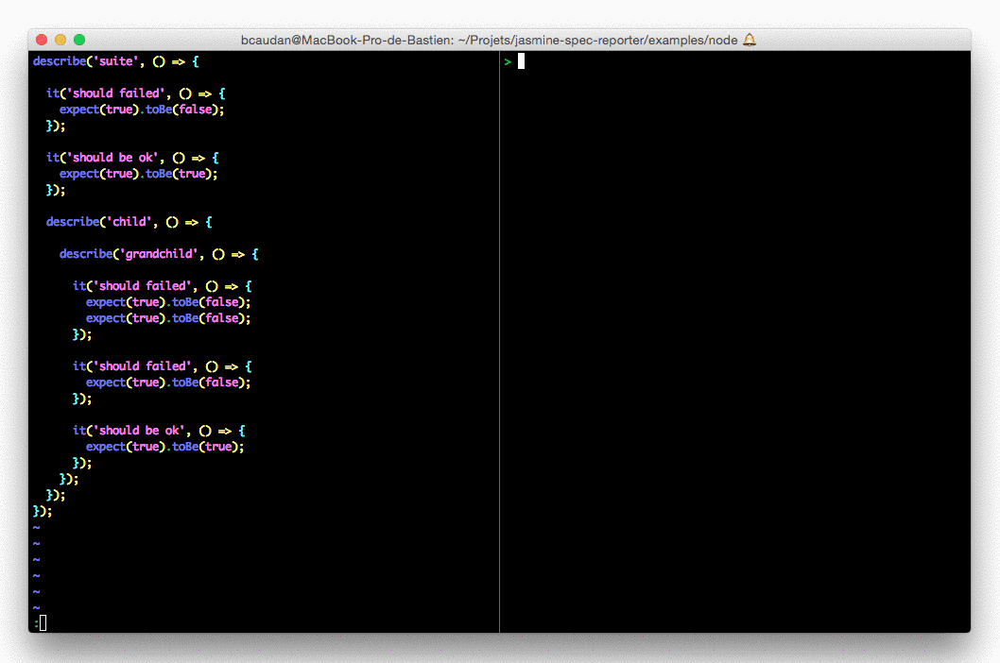

jasmine-spec-reporter
=====================

Real time console spec reporter for jasmine testing framework.

# Usage

## Installation
Install `jasmine-spec-reporter` via npm:

    npm install jasmine-spec-reporter --save-dev

## Examples
* [Jasmine node tests](examples/node)
* [Protractor tests](examples/protractor)
* [TypeScript support](examples/typescript)

## Configuration
See full configuration and features: [configuration.ts](src/configuration.ts)

## Custom output
You can customize the output of the reporter yourself: [see how](docs/customize-output.md).

# Developement

## Requirements

* node >= 6.9
* yarn

## Commands

* install dependencies: `yarn`
* launch unit tests: `yarn test`
* launch integration tests: `yarn test:integration`

## Debugging

Unit tests hijack `console.log` to verify output; use `console.warn` to debug.
